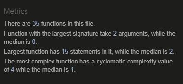

# **Movie Trivia**

## **Project Goals** 

The goal of this project was to create an app using HTML, CSS and JavaScript, focusing on JavaScript. 
I've decided to create a movie quiz using an API. The idea was to create a quiz that is fun to play and also contains interesting movie trivia so user can learn something new while playing. 
 

---

## Table of contents 
* [User Experience Design](#user-experience-design)
     * [The Strategy Plane](#the-strategy-plane)
         * [User Stories](#user-stories)
    * [The Scope Plane](#the-scope-plane)
         * [Existing Features](#existing-features)
        * [Features to be implemented](#features-to-be-implemented)
    * [The Structure Plane](#the-structure-plane)
    * [The Skeleton Plane](#the-skeleton-plane)
       * [Wireframes](#wireframes)
    * [The Surface Plane](#the-surface-plane)
      * [Design Choices](#design-choices)
          * [Typography](#typography)
          * [Colors](#colors)
* [Technologies used](#technologies-used)
    * [Languages](#languages)
    * [Libraries and Frameworks](#libraries-and-frameworks)
    * [Tools](#tools)
* [Testing](#testing)
* [Deployment](#deployment)
* [Credits](#credits)
* [Acknowledgments](#acknowledgments)

# **User Experience Design**

## **The Strategy Plane**

### **Site owners Goals**

* To have an appealing website where users want to go to play 
* For the users to have fun while playing 
* For the users to learn something new while playing 

### **User Goals**

* To understand the game easily and to have fun playing
* To be able to play the game on various devices, tablets, mobile phones and desktops
* To have the option to choose the level of difficulty 
* To find out the correct answer if I answer incorrectly
* To be able to track the score and see how many questions are left in the game
* To be able to see how much time I have to answer the question

[Back to Top](#table-of-contents)

### **User Stories**

* As a user, I want the website to be easy to use.
* As a user, I would like to know the rules before I start playing.
* As a user, I would like to be able to choose the level of difficulty.
* As a user, I would like to know which question I am on and how many questions are left.
* As a user, I would like to know how much time I have to answer the question.
* As a user, I would like to track my score while playing. 
* As a user, I expect a variety of questions and no repeated questions.
* As a user, I would like to know the correct answer when answered incorrectly.
* As a user, I want to be able to restart the game if Im'm not happy with my answers.

[Back to Top](#table-of-contents)

# **The Scope Plane**
## **Features**

### **User Requirements and Expectations**

#### Requirements

* Appealing homepage
* Easy to navigate by using only a few buttons
* Easy to pick a difficulty level and start playing
* Validate the correct answer
* Keep the score while playing

#### Expectations

* When a certain level is chosen, that the correct questions appear
* Feedback given to the users what stage in the game they are and the total amount of questions
* Time is displayed so the user knows how much time they have to answer the question
* To let the user know if their answer was correct 
* Show correct answer when answered incorrectly
* To show the final result when game is finished

### **Existing Features**

* Use of [open Trivia API](https://opentdb.com/) to populate the questions
* Ability to choose preferred level of difficulty
* Instructions for the user on how to play the game
* Validation of answers
* Feedback when the answer was incorrect
* Tracker for the questions and score
* Countdown timer for each question

### **Features to be implemented**

# **The Structure Plane**

# **The Skeleton Plane**

[Back to Top](#table-of-contents)

--- 

## **Wireframes**

Wireframes were created using the wireframing tool [Balsamiq](https://balsamiq.com/wireframes/)

### Home Page Wireframes [Home Page](workspace/Movie-Quiz/wireframes/home-page.pdf)

### Quiz Page Wireframes [Quiz Page](workspace/Movie-Quiz/wireframes/quiz-page.pdf)
  

[Back to Top](#table-of-contents)

# **The Surface Plane** 

### **Design Choices**

The design was guided by vintage movies and cinema look, inspired by the hero image. 

### **Typography**

Font **Oswald** was chosen for the title, the movie quote and the answer choices\
Font **Bungee Inline** was chosen for the question and the buttons\
**Sans Serif** is chosen as the fallback font in case the Google fonts do not load

### **Color Scheme**

Color palette was generated from the hero image using [Image Color Picker](https://imagecolorpicker.com/en)

Red color  #d51e13  was used as the question container background image, to contrast the light color of the hero image and also for title and score

Cream color  #f2d38c  was used for the questions and also for the background of the answer choices in contrast to the red

---

## **Technologies used**

### Languages

1. [HTML](https://en.wikipedia.org/wiki/HTML#:~:text=Hypertext%20Markup%20Language%20(HTML)%20is,scripting%20languages%20such%20as%20JavaScript.)

1. [CSS](https://en.wikipedia.org/wiki/CSS)

1. [JavaScript](https://en.wikipedia.org/wiki/JavaScript)

### Libraries and Frameworks

1. [Bootstrap](https://getbootstrap.com/docs/4.4/getting-started/introduction/)
    
1. [Google Fonts:](https://fonts.google.com/)
    
1. [Font Awesome:](https://fontawesome.com/)

### Tools
    
1. [Open Trivia Database](https://opentdb.com/)
   
1. [Gitpod](https://www.gitpod.io/)
   
1. [Git](https://git-scm.com/)
    
1. [GitHub:](https://github.com/)
    
1. [Balsamiq:](https://balsamiq.com/)
   
1. [TinyPNG](https://tinypng.com/)
   
1. [Chrome Developer Tools](https://developers.google.com/web/tools/chrome-devtools)

1. [Favicon Maker](https://favicon.io/)
 

[Back to Top](#table-of-contents)

  

# **Testing**

  

## **Code Validation**

* [HTML validator](https://validator.w3.org/) 

  - index.html - Document checking completed. No errors or warnings to show.
  - end.html - Document checking completed. No errors or warnings to show.

* [CSS Validator](https://jigsaw.w3.org/css-validator/) - 
Passing without errors but giving warnings about vendor extensions.

* [JSHint](jshint.com) 
  - app.js\
  
  - end.js\
  

&nbsp;

## **User Stories Testing** 

&nbsp;

### **Rules button**

#### As a user, I would like to know the rules before I start playing.

* **Plan**  
If a user doesn't know how to play the game, they should be able to click a 'Rules' button to read the instructions. 

* **Implementation**  
On the welcome screen, I've added a 'Rules' button that triggers a modal. 
When the modal opens you can see the steps on how to play the quiz. 
When you've read the instructions you can close the modal by clicking the "Got it!" button at the bottom or the "X" button at the top.
When clicking either button, the modal closes and the user can start playing the game. 

* **Test**  
I have tested the modal on various browsers and devices. 
 
   
* **Result**  

The modal works as planned and contributes to a better overall user experience.

* **Verdict**  
The test has passed all the criteria and works as planned.

  

### **Choosing difficulty level**

#### User story:  As a user, I would like to be able to choose the level of difficulty.

* **Plan**  
When the page is loaded, the user should have the option to choose the difficulty level they want to play - Easy, Normal or Hard.\
The user shouldn't be able to proceed if the difficutly level is not chosen.

* **Implementation**  
I created a dropdown "Difficulty" button on the welcome screen that user can click and select their option. In javascript, I set the default difficulty level to null so the user has to choose the level before proceeding to play.

* **Test**  
I have tested whether the hover is working when you hover over each option.\
I have tried selecting different levels to make sure the correct level is being chosen.\
I have checked whether the questions from the selected level are being displayed.

    

* **Result**  
When you hover over each option, the background color changes, so the hover is working. I have disabled hover on touch devices.\
When you click on each level, the button text changes to that particular level name, so user can see what they've chosen.\
When you choose your level, you get the correct questions from the chosen difficulty level.

  
* **Verdict**    
The test has passed all the criteria and works as planned.

[Back to Top](#table-of-contents)
  

### **Question Counter**

#### User story: As a user, I would like to know which question I am on and how many questions are left.

* **Plan**
When user starts the quiz they can clearly see what question they are on, out of how many questions.

* **Implementation** 
I've added the question counter above the question container so it is easy for user to see it. 
It is displayed in 1/10 format so user can quickly tell how many questions are left till the end.

* **Test** 
When user answers the first question, the next question appears and the question counter increases by one. 
Once the user has answered all 10 questions, the end screen appears. 

* **Result**  
Question counter works as planned across various devices and browsers. 

* **Verdict**   
The test has passed all the criteria and works as planned.

  

## **Bugs**

* **Choosing difficulty level** - 
 The game is intended to be played in portrait mode on mobile devices. Should the user wish to play in landscape mode, it is still possible, but they will need to scroll down to choose level and then back up to play the game which is not user friendly. 
 
* **Question Counter** -
 On mobile screen size question 10/10 was overflowing its container and displaying underneath the rest of the row. To avoid that I have reduced font size for the tracking container 

* **Adding quotes from a local json file** - 
The function works as intended, however the console throws the following error: "Uncaught SyntaxError: Unexpected token ':'".
I have validated the json file with two different online validators and the result was - valid. Please see images. 
Application works despite the error. 

  

  

[Back to Top](#table-of-contents)

  

## **Deployment**
### **Project Creation**

1. A local project was created in GitHub with a new repository called 'Movie Trivia'
1. During the creation of the project regular commits were added 
1. Commits were then pushed to the GitHub website before deployment

### **Using Github Pages**
1. Navigate to the GitHub [Repository](https://github.com/TanYa-Go/Movie-Quiz)
1. Click the 'Settings' Tab.
1. Scroll Down to the Git Hub Pages Heading.
1. Select 'Master Branch' as the source.
1. Click the Save button.
1. Click on the link to go to the live deployed page.

### **Run Locally**
1. Navigate to the GitHub [Repository](https://github.com/TanYa-Go/Movie-Quiz)
1. Click the Code drop down menu.
1. Either Download the ZIP file, unpackage locally and open with IDE (This route ends here) OR Copy Git URL from the HTTPS dialogue box.
1. Open your development editor of choice and open a terminal window in a directory of your choice.
1. Use the 'git clone' command in terminal followed by the copied git URL.
1. A clone of the project will be created locally on your machine.

[Back to Top](#table-of-contents)
  

## **Credits**

### **Images**

* Hero image was taken from [Pixabay](https://pixabay.com/illustrations/cinema-demolition-map-popcorn-3700545/)
* Favicon image was taken from [Pixabay](https://pixabay.com/illustrations/popcorn-cinema-caf%C3%A9-movie-4268489/)

### **Music**

* Backround music was taken from [Zapsplat](https://www.zapsplat.com/sound-effect-category/tv-show-and-themes/page/2/
)
* Sound effects for different score sounds were taken from [YouTube](https://www.youtube.com/watch?v=7DwPU-Vs2qI)

### **Code**

* Took inspiration from the [James Q Quick YouToube tutorial](https://www.youtube.com/watch?v=u98ROZjBWy8&list=PLDlWc9AfQBfZIkdVaOQXi1tizJeNJipEx)

* Learned a lot doing the Javascript complete guide course with [Maximillian Schwarzmuller](https://www.udemy.com/course/javascript-the-complete-guide-2020-beginner-advanced/)

* Learned more about fetch from [John Linatoc](https://medium.com/@johnwadelinatoc/manipulating-the-dom-with-fetch-7bfddf9c526b)

* Borrowed idea for how to remove hover on touch devices from [Stefan Judis](https://www.stefanjudis.com/today-i-learned/the-hover-media-query-can-help-to-remove-hover-styles-on-touch/)

* Learned more about timers [here](https://www.tutorialrepublic.com/javascript-tutorial/javascript-timers.php)

* Learned about routing and relative URL paths on [Stack Overflow](https://stackoverflow.com/questions/1655065/redirecting-to-a-relative-url-in-javascript)